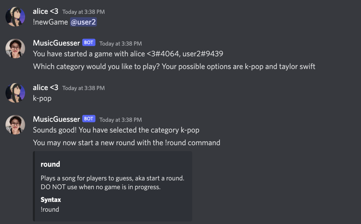
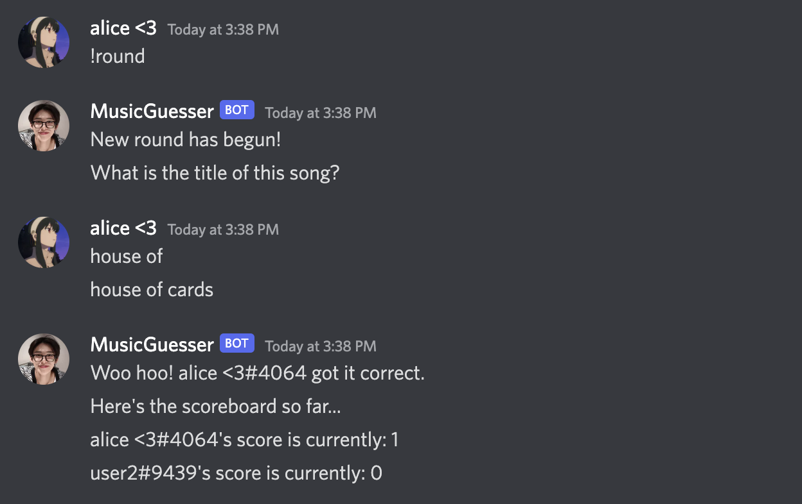
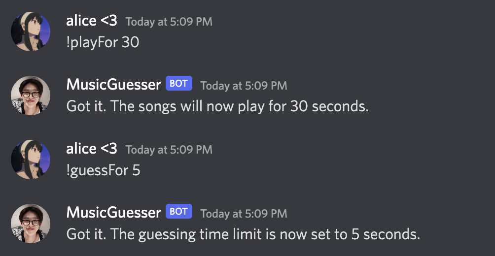
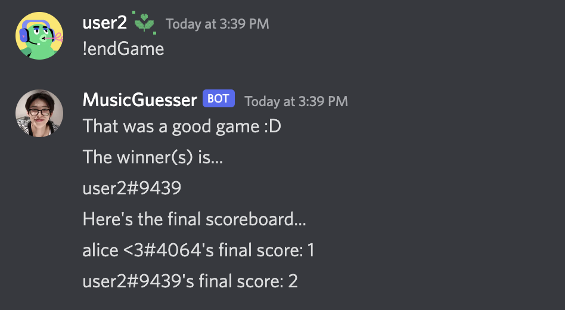

# Music Guesser Discord Bot
**Built:** 1 day in January 2022, and 1 day in September 2022.

**What it is**: A multi-player music guessing Discord game.

**What I learned**:
- **Python:** Previous to this project, I had no Python experience at all. 
  I self-studied Python and built this bot all in one day. 
  This bot is not perfect by any means, but I believe it demonstrates my ability to pick up new skills quickly very well. 
  
## Demo
The below video demonstrates both single-player mode and multi-player mode:

## Gameplay / Features

1. [Start a new game](#Start-a-new-game)
2. [Start a new round](#Start-a-new-round)
3. [Set game options](#Set-game-options)
4. [End a game](#End-a-game)

### Start a new game

**Command:** 
- Single-player game: ``!newGame``
- Multi-player game: ``!newGame [@ mention friends]``

The bot will then ask you which category you'd like the music to be from. 
The current options are K-Pop and Taylor Swift. 
Once you select a category, the game begins!

### Start a new round

**Command:** ``!round``

The bot will then automatically start playing a random song for 10 seconds. 
After the song finishes, players have 15 seconds to guess the correct song title.
The first person to guess correctly will win a point.

To change how long songs are played and how long players have to guess, see the
[Set game options](#Set-game-options) section.

### Set game options 

**Command:** ``!playFor [seconds]`` 

Sets how long the song is played. For example, if a user types ``!playFor 30``,
songs will now be played for 30 seconds instead of the default 10 seconds.

**Command:** ``!guessFor [seconds]`` 

Sets how long users have to guess. For example, if a user types ``!guessFor 5``,
users will now only have 5 seconds to guess the correct song title instead of the default 15 seconds.

### End a game

**Command:** ``!endGame`` 

Ends the game and announces the winner and final scoreboard!

